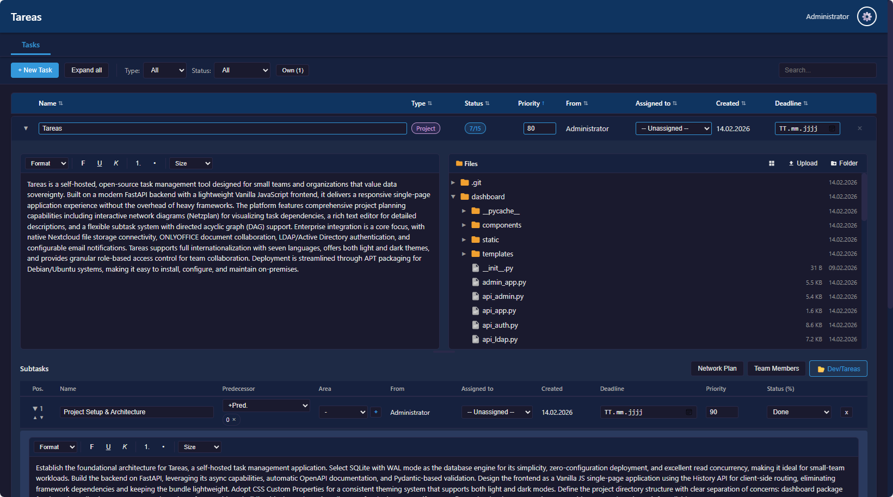
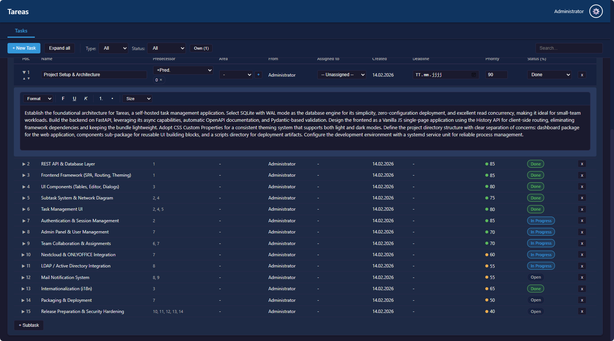
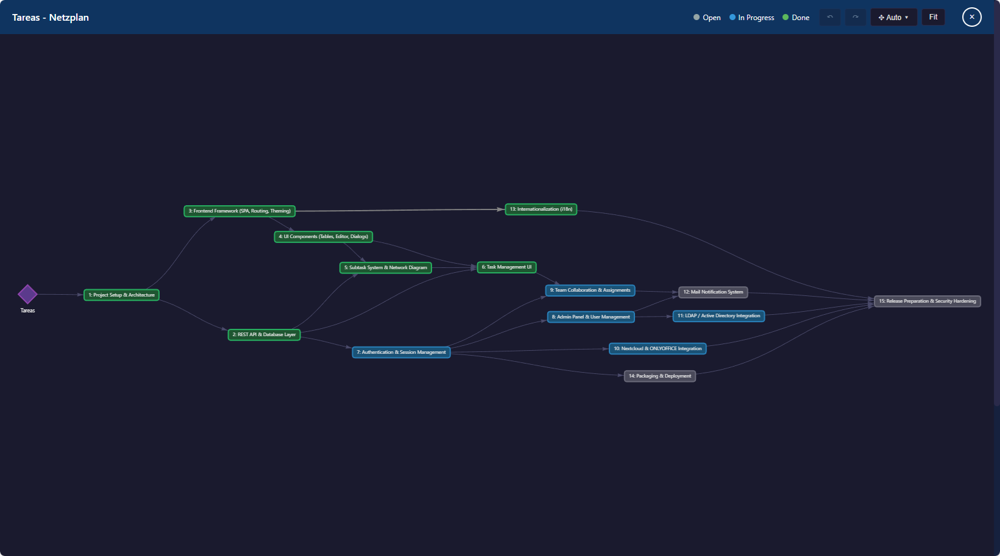

# Tareas

A self-hosted task and project management tool built with **FastAPI** and **Vanilla JavaScript**. Tareas is optimized for collaboration with AI agents: agents can work with projects, subtasks, notes, dependencies, and assignments through the built-in MCP server while all write actions stay attributable and auditable.

## Features

- **Task & Project Management** - Create tasks, organize them into projects with subtasks, dependencies, and deadlines
- **Interactive Network Diagram** - Visualize project dependencies as an interactive graph (vis-network)
- **Team Collaboration** - Assign tasks, manage team permissions (read/edit/create), notes system
- **WYSIWYG Editor** - Rich text descriptions for tasks and subtasks
- **File Storage** - Nextcloud/WebDAV integration with tree view, drag & drop upload, context menus
- **ONLYOFFICE Integration** - Edit Office documents (docx, xlsx, pptx) directly in the browser via WOPI
- **LDAP/Active Directory** - Authenticate users against AD, automatic sync, group-based access
- **Email Notifications** - SMTP integration with configurable templates for assignments, status changes, deadlines
- **AI Agent Collaboration** - Built-in MCP server for project/task automation by AI agents with token-based access
- **TLS Support** - Optional HTTPS with certificate management via Admin UI
- **Admin Panel** - Separate admin interface (Port 8505) for user management, LDAP, Nextcloud, ONLYOFFICE, mail, TLS, and MCP configuration
- **Light/Dark Theme** - CSS Custom Properties with persistent preference
- **APT Package** - Install via `.deb` package on Ubuntu/Debian

## Screenshots

**Project view** — Rich text description, Nextcloud file browser, inline editing


**Subtask list** — Dependencies, status tracking, priority, assignments


**Network diagram** — Interactive dependency graph with auto-layout and status colors


## Installation

### Option 1: APT Package (Recommended)

```bash
curl -s https://your-repo-server/tareas/install.sh | bash
```

This sets up the APT repository and installs Tareas with all dependencies.

### Option 2: Manual Installation

```bash
# Clone the repository
git clone https://github.com/Manerba/tareas.git
cd tareas

# Create virtual environment
python3 -m venv venv
source venv/bin/activate

# Install dependencies
pip install -r requirements.txt

# Start the application
python dashboard/app.py
```

The dashboard is available at `http://localhost:8504`.

> **Note:** Tested on Ubuntu 24.04 Server (standard installation).

### Option 3: Systemd Service

After manual installation, copy the service files:

```bash
cp scripts/tareas.service /etc/systemd/system/
cp scripts/tareas-admin.service /etc/systemd/system/
systemctl daemon-reload
systemctl enable --now tareas tareas-admin
```

## Configuration

All configuration is managed through the **Admin Panel** at `http://localhost:8505`:

| Feature | Admin Tab | Description |
|---------|-----------|-------------|
| General | Allgemein | Server address for email links |
| Users | Benutzer | Create/manage local users |
| LDAP | LDAP | Active Directory connection and sync |
| Nextcloud | Nextcloud | WebDAV file storage integration |
| ONLYOFFICE | ONLYOFFICE | Document Server URL and JWT secret |
| Mail | Mail | SMTP settings and notification templates |
| TLS | TLS | HTTPS certificate paths |
| MCP | MCP | Server status, API tokens, audit log, global kill switch |

### MCP Server

Tareas exposes a Model Context Protocol (MCP) server at `/mcp/` for AI agents and remote coding assistants. The server is mounted in the main app on port `8504` and uses Streamable HTTP via FastMCP.

- Authentication uses `Authorization: Bearer <token>`.
- MCP tokens are created in the Admin Panel under **MCP** and are shown only once.
- Tokens are stored as SHA-256 hashes; revoked tokens stop working immediately.
- Every token is mapped to its own `mcp` user in the database.
- Write operations are recorded in the audit log and can be reviewed in the Admin Panel.
- Available tools cover projects, subtasks, dependencies, editable notes (`note.*`), handoffs/progress history (`handoff.*`), users, areas, search, self-assignment, and `whoami`.

For using Tareas as the planning layer in another repository, see
[Tareas Agent Guide](docs/tareas-agent-guide.md). The guide includes the
recommended `AGENTS.md` snippet, Codex/Claude MCP setup, verification steps,
and secret-handling rules.

Running Tareas instances also expose token-free bootstrap endpoints directly:

- `GET /agent-guide.md` - Markdown guide for agents and humans
- `GET /.well-known/tareas-agent.json` - machine-readable URLs, MCP metadata, and `AGENTS.md` snippet

### Default Credentials

On first start, create an admin user via the admin panel. The first user created automatically gets admin privileges.

### Database

Tareas uses **SQLite** with WAL mode. The database is stored at `data/tareas.db` and created automatically on first start. No external database server required.

## Architecture

```
Tareas/
├── dashboard/
│   ├── app.py              # Main FastAPI app (Port 8504)
│   ├── admin_app.py         # Admin FastAPI app (Port 8505)
│   ├── api_*.py             # API routers (tasks, auth, teams, etc.)
│   ├── mcp_server.py        # MCP tools for AI agents
│   ├── components/          # Reusable Python components
│   ├── static/
│   │   ├── css/             # Stylesheets (theme, components)
│   │   └── js/              # Frontend JavaScript (SPA)
│   └── templates/           # HTML templates
├── scripts/                 # Systemd service files
├── packaging/               # .deb package configuration
├── data/                    # SQLite database (created at runtime)
├── requirements.txt
└── version.txt
```

### Tech Stack

| Layer | Technology |
|-------|-----------|
| Backend | Python 3.10+, FastAPI, Uvicorn |
| Frontend | Vanilla JavaScript (no framework), CSS Custom Properties |
| Database | SQLite (WAL mode, foreign keys) |
| Auth | bcrypt + itsdangerous (cookie sessions) |
| Encryption | Fernet (credentials at rest) |
| File Storage | Nextcloud WebDAV proxy |
| Documents | ONLYOFFICE via WOPI |
| Directory | LDAP/Active Directory (ldap3) |
| AI Agent Interface | MCP via FastMCP, Bearer tokens, audit log |

## Development

```bash
# Run in development mode
source venv/bin/activate
python dashboard/app.py        # Main app on :8504
python dashboard/admin_app.py  # Admin app on :8505
```

### Adding a New Tab

1. Create JS file: `dashboard/static/js/tab_example.js`
2. Define init function: `async function initExampleTab() { ... }`
3. Register in `app_core.js`: add to `switchTab()` and `tabMap`/`buildPath`
4. Add to `index.html`: tab link in `<nav class="tabs">` + `<script>` include
5. Optional: add API router in a new `api_example.py`

### Components

- **ExpandableTable** - Sortable, filterable table with expandable detail rows
- **KPI Cards** - Dashboard widgets with KPI cards and sections
- **WYSIWYG Editor** - ContentEditable-based rich text editor with HTML sanitization

## Security

- CSRF protection (X-Requested-With header validation)
- Content Security Policy (CSP) headers
- Rate limiting on login and password changes
- SQL identifier whitelisting
- HTML sanitization (XSS prevention)
- Fernet encryption for stored credentials
- MCP tokens stored as hashes; global MCP kill switch
- Audit logging for MCP and relevant write operations
- Path traversal protection for file operations
- Systemd hardening (NoNewPrivileges, ProtectSystem, PrivateTmp)

## License

[MIT](LICENSE)
