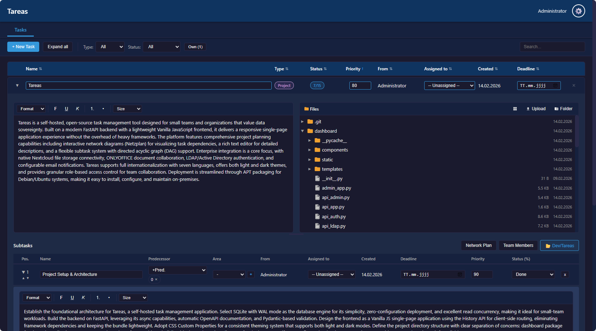
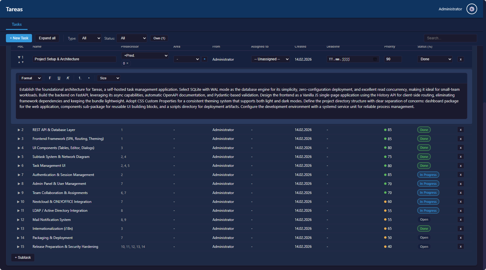
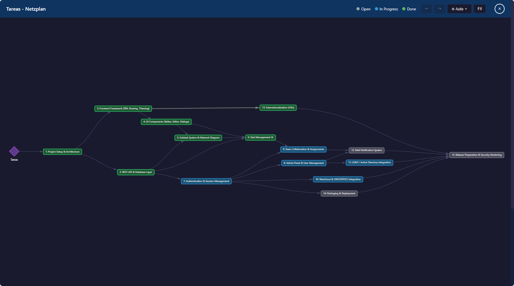

# Tareas

A self-hosted task and project management tool built with **FastAPI** and **Vanilla JavaScript**. Tareas is optimized for collaboration with AI agents: agents can work with projects, subtasks, notes, dependencies, and assignments through the built-in MCP server while all write actions stay attributable and auditable.

## Features

- **Task & Project Management** - Create tasks, organize them into projects with subtasks, dependencies, and deadlines
- **Cancellation** - Keep cancelled tasks and projects with their content, filter by status, and resume them when needed
- **Interactive Network Diagram** - Visualize project dependencies as an interactive graph (vis-network)
- **Sharing & Permissions** - Creators and administrators share tasks and projects through Settings → Permissions. Read or edit access is separate from assignment; projects also offer permission to create subtasks. Changes are saved together or discarded with Cancel. Admins can edit all projects, tasks, notes and handoffs regardless of ownership.
- **Markdown Descriptions & Notes** - Formatted reading view with source editing, lists, tables, and code blocks
- **File Storage** - Dedicated local storage per task/project or a Nextcloud/WebDAV directory, with tree view, drag & drop upload and context menus
- **Text File Editor** - Preview and edit Markdown, text and scripts in a dialog, with a pop-out window that retains unsaved edits
- **ONLYOFFICE Integration** - Edit Office documents (docx, xlsx, pptx) directly in the browser via WOPI
- **LDAP/Active Directory** - Authenticate users against AD, automatic sync, group-based access
- **Email Notifications** - SMTP integration with configurable templates for assignments, status changes, deadlines
- **AI Agent Collaboration** - Built-in MCP server for project/task automation by AI agents with token-based access
- **TLS Support** - Optional HTTPS with certificate management via Admin UI
- **Admin Panel** - Separate admin interface (Port 8505) for user management, LDAP, Nextcloud, ONLYOFFICE, mail, TLS, and MCP configuration
- **Light/Dark Theme** - CSS Custom Properties with persistent preference
- **APT Package** - Install via `.deb` package on Ubuntu/Debian

## Screenshots

**Project view** — Rich text description, Nextcloud file browser, inline editing


**Subtask list** — Dependencies, status tracking, priority, assignments


**Network diagram** — Interactive dependency graph with auto-layout and status colors


## Installation

### Option 1: APT Package (Recommended)

```bash
curl -s https://your-repo-server/tareas/install.sh | bash
```

This sets up the APT repository and installs Tareas with all dependencies.

### Option 2: Manual Installation

```bash
# Clone the repository
git clone https://github.com/Manerba/tareas.git
cd tareas

# Create virtual environment
python3 -m venv venv
source venv/bin/activate

# Install dependencies
pip install -r requirements.txt

# Start the application
python dashboard/app.py
```

The dashboard is available at `http://localhost:8504`.

> **Note:** Tested on Ubuntu 24.04 Server (standard installation).

### Option 3: Systemd Service

After manual installation, copy the service files:

```bash
cp scripts/tareas.service /etc/systemd/system/
cp scripts/tareas-admin.service /etc/systemd/system/
cp scripts/tareas-mcp.service /etc/systemd/system/
systemctl daemon-reload
systemctl enable --now tareas tareas-admin tareas-mcp
```

## Configuration

All configuration is managed through the **Admin Panel** at `http://localhost:8505`:

| Feature | Admin Tab | Description |
|---------|-----------|-------------|
| General | Allgemein | Server address for email links |
| Users | Benutzer | Create/manage local users |
| LDAP | LDAP | Active Directory connection and sync |
| Nextcloud | Nextcloud | WebDAV file storage integration |
| ONLYOFFICE | ONLYOFFICE | Document Server URL and JWT secret |
| Mail | Mail | SMTP settings and notification templates |
| TLS | TLS | HTTPS certificate paths |
| MCP | MCP | Server status, API tokens, audit log, global kill switch |

### Project view

The task list defaults to descending ID order. The **Tareas** link in the compact
header returns to the task list. The column headings stay visible below the
header and filter bar while scrolling, including when the filters wrap onto
multiple lines.

Expanding a project shows its row and details while hiding the other list rows
and the main table header and filter bar. Collapsing it restores the list and
filter bar with the current filters and sort order. The subtask table header
stays visible within the project.

Expand a subtask and choose **Projekt verknüpfen** to attach an existing project
or create a child project. Each subtask can have one child project. Its progress
is the percentage of fully completed subtasks in that child project, rounded
down (an empty project gives 0%). Changes propagate through nested projects.
The parent's progress is read-only in the UI, REST and MCP while linked.
The **PID** column contains the parent **subtask ID** and opens that subtask.
Linking or unlinking requires edit access to both sides and does not grant any
additional access. Cycles are rejected. Unlinking or deleting a child project
keeps the parent's last progress and restores manual editing. Deleting a parent
subtask or project detaches its child projects without deleting them.

MCP `create_project` and `update_project` accept `parent_subtask_id`;
`update_project(parent_subtask_id=0)` unlinks. Project responses include
`parent_subtask_id`, `parent_project_id` and `progress_percent`. Subtasks expose
`child_project_id` and `progress_automatic`; attempting to write their linked
progress returns `linked_project_progress_readonly` with field `status_percent`.

Subtask handoffs appear as a responsive grid beside the description. Each compact
widget shows its ID, author, timestamp and a single-line preview of the note.
Drag the separator to adjust the column widths or the bottom handle to resize
their shared height. Project and task handoffs use the same widgets in a grid
that grows with its content, without a resizable frame.
Click a handoff to open its dialog, or double-click to open a separate browser
window directly. The dialog's **Ausklappen** button also opens a window and retains
unsaved edits. Administrators can edit existing handoffs; saving preserves the
original author and timestamp. Description panels retain their size when
switching between reading and editing.

Dependencies must belong to the same project and cannot form cycles or redundant
direct links. If C depends on B and B depends on A, C only needs B as a direct
predecessor. This is enforced in the UI, REST API and MCP tools, including when
a new indirect path would make an existing direct link redundant. Replace the
predecessor list or remove the redundant link before adding the new connection.

### File storage

Open a task or project and choose **Dateiablage**. Select **Lokale Dateiablage**
to create its own directory on the Tareas server, or **WebDAV-Verzeichnis** to
select an existing directory from the configured Nextcloud share. Local storage
works without a Nextcloud configuration. Both options support the file browser
and ONLYOFFICE editing when ONLYOFFICE is configured.

File uploads accept one multipart file up to 500 MiB. The limit is enforced
while receiving the file, including uploads without `Content-Length`.
Oversized uploads stop with HTTP 413 and their temporary files are closed;
the existing stored file is preserved. No size preflight is required.

Double-click a Markdown file to open its formatted preview in a dialog. Text and
script files (including `.txt`, `.ps1`, `.sh`, `.py`, `.js`, JSON and YAML) open as
literal text in the same editor, independently of ONLYOFFICE. Choose **Bearbeiten**
to edit, then **Speichern** or **Abbrechen**, as with project descriptions. Read-only
members can view files. The **Ausklappen** button moves the editor into a separate
browser window and retains unsaved edits; the browser may choose a tab instead.
If pop-ups are blocked, the draft stays in the dialog.

The native editor supports files up to 2 MiB, encoded as UTF-8 (with or without
BOM) or UTF-16 with BOM. It preserves the encoding, BOM and the existing newline
style when saving. Binary files, unsupported encodings and larger files remain
available for download. Saves check the loaded revision and report a conflict if
the file has changed; the editor stays in edit mode and retains the draft.
Revision checks and writes use a shared process lock in the file storage layer,
including saves on ports 8504/8506, MCP writes and uploads. This lock lasts only
for the save operation; opening or editing a file does not reserve it.
Text editing uses
`GET`/`PUT /api/tasks/{id}/files/text?path=...` with the existing file permissions,
CSRF protection and audit logging. A PUT supplies `content` and the `revision`
returned by GET.

Local files are stored in `data/files/task-<ID>/` relative to the installation
directory (`/opt/tareas/data/files/` for the Debian package). Directory names stay
stable when tasks are renamed. Files are served through authenticated APIs using
the task/project permissions. Include `data/files/` along with the database in
backups; this directory is excluded from Git and fits the existing systemd write
permissions.

Use the configuration button in the file browser header to change or remove its
storage. Removing local storage requires confirmation and deletes that task's
directory, including all files and subfolders. Removing a WebDAV assignment keeps
the remote directory and its contents.

Switching storage keeps files in their original location. Reassigning local
storage reuses that task's directory if it still exists. Deleting a task retains
its local directory on disk for manual recovery or cleanup; the deleted task's
files are no longer accessible through the API. Switching storage requires
reopening active Office editors.

### MCP Server

Tareas exposes a Model Context Protocol (MCP) server at `/mcp/` for AI agents and
remote coding assistants, using Streamable HTTP via FastMCP. The dedicated
`tareas-mcp.service` listens on port `8506`. The existing endpoint on port `8504`
remains available, so connected agents do not need to change their configuration.
Both services share the same tool definitions, authentication, tokens, database,
project permissions, audit log and global MCP switch.

Port `8506` exposes MCP, the project file REST API, `/agent-guide.md` and
`/.well-known/tareas-agent.json`. It serves no web UI, login, admin UI or general
task REST API. File requests on this port require a MCP Bearer token even if a
browser session cookie is present. Tokens are checked before reading the request
body and checked again after receiving an upload. This lets a firewall expose only port `8506`
while keeping UI ports `8504` and `8505` internal. The dedicated service uses the
same TLS configuration and certificate as the main app. Use HTTPS for external
access; installation does not change firewall rules.

The Admin MCP tab shows both addresses and uses port `8506` in new connection
examples. Agent guides requested through the dedicated service also use its
address for REST file transfers. The services can restart independently; active
MCP transport sessions belong to the endpoint where they were established.

- Authentication uses `Authorization: Bearer <token>`.
- MCP tokens are created in the Admin Panel under **MCP** and are shown only once.
- Tokens are stored as SHA-256 hashes; revoked tokens stop working immediately.
- Every token is mapped to its own `mcp` user in the database.
- Assigning a project to a user grants access to notes and handoffs on all its subtasks, including writing their own notes and handoffs. Individual subtask assignments are not required for this access.
- Write operations are recorded in the audit log and can be reviewed in the Admin Panel. Admin-only `note.update` and `handoff.update` correct existing content while preserving its author and creation time.
- Available tools cover projects, subtasks, dependencies, editable notes (`note.*`), handoffs/progress history (`handoff.*`), project files (`file.*`), users, areas, search, self-assignment, and `whoami`.

Use `list_projects_page` for compact project lists. It returns `items`, `total`,
`offset`, `limit`, and `next_offset`; pass `next_offset` as the next request's
`offset` until it is `null`. The default page size is 50, with a maximum of 500.
Descriptions are omitted unless `include_description=true`; use `get_project`
to load a project's full description and subtasks. Results retain visibility
checks and sort by priority descending, creation time descending, then ID
descending. Keep the same filters while paging; concurrent changes can shift
offsets. The existing `list_projects` tool keeps its list response for existing
clients. Both tools filter by the effective project status.

REST and MCP accept the statuses `offen`, `in_arbeit`, `erledigt`, and
`abgebrochen`, and require subtask progress to be an integer from 0 to 100.
Project status follows the web UI: no completed subtasks means `offen`, some
completed subtasks means `in_arbeit`, and all completed subtasks means `erledigt`.
An empty project is `offen`; partially progressed subtasks alone do not change
that status. `abgebrochen` overrides progress until the project is resumed with
`status="offen"`. Ordinary tasks retain a manually set status. A project with
all subtasks completed needs no separate completion call.

MCP tool errors retain `isError=true` and provide `code`, `message`, and, when
applicable, `field`/`fields` in `structuredContent` and as JSON text. Clients can
handle codes such as `invalid_status`, `invalid_progress`, `dependency_cycle`,
and `storage_not_configured` without parsing a localized message. REST clients
keep their existing error response format.

Agents access configured local or WebDAV storage through `file.list`, `file.read`,
`file.write`, `file.mkdir`, `file.move`, and `file.delete`. Pass the project ID as
`task_id` and paths relative to its storage root. Read access allows listing and
reading, edit access allows file changes. Permissions are checked on every call.
`get_project` includes `file_storage_type`; `file.list` includes `can_write` and
pagination via `next_offset` (default 200, maximum 500 entries).

If no storage is configured, expand the task/project in the web UI and use the
**Dateiablage** (file storage) button to choose local storage or WebDAV. Once
configured, storage settings are in the file browser header. Configuration
requires edit access to the task/project (creator, admin,
or an explicit edit share); an assignment alone is insufficient. Reading files
requires read access, while file changes require edit access. MCP file tools
never configure storage automatically.

`file.read` returns text as UTF-8 or binary data as Base64, identified by `encoding`.
`file.write` accepts either encoding and replaces the entire file. Parent folders
must exist. MCP reads/writes are limited to 1 MiB per file; use the REST file API or
web UI for larger files. Moves never overwrite existing destinations. Deleting a
folder deletes its contents too; the storage root cannot be deleted through these
tools. Audit entries record the acting user and file operation, without file contents.

The same MCP token also authenticates the REST file API without a browser session.
Send `Authorization: Bearer <token>` on each request. Writes additionally require
`X-Requested-With: XMLHttpRequest`. Paths are relative to the task's configured
local or WebDAV storage. The token user's task permissions, token revocation and
the global MCP switch apply to every request. An explicit authorization header
takes precedence over a session cookie.

| Method | Endpoint | Parameters / body |
|--------|----------|-------------------|
| GET | `/api/tasks/{task_id}/files` | Optional `path` query for a subfolder |
| GET | `/api/tasks/{task_id}/files/download` | `path` query, returns file bytes |
| GET | `/api/tasks/{task_id}/files/text` | `path` query, returns text, format, write access and revision, maximum 2 MiB |
| PUT | `/api/tasks/{task_id}/files/text` | `path` query, JSON `{"content": "text", "revision": "<revision from GET>"}` |
| POST | `/api/tasks/{task_id}/files/upload` | Multipart field `file`, optional folder `path` query, maximum 500 MiB |
| POST | `/api/tasks/{task_id}/files/mkdir` | JSON `{"name": "folder"}`, optional parent `path` query |
| PUT | `/api/tasks/{task_id}/files/move` | JSON `{"source": "old.txt", "destination": "new.txt"}` |
| DELETE | `/api/tasks/{task_id}/files` | `path` query, folders are deleted recursively |

Other REST endpoints, storage configuration and the Office editor still require
a browser session.

For using Tareas as the planning layer in another repository, see
[Tareas Agent Guide](docs/tareas-agent-guide.md). The guide includes the
recommended `AGENTS.md` snippet, Codex/Claude MCP setup, verification steps,
and secret-handling rules.

Running Tareas instances also expose token-free bootstrap endpoints directly:

- `GET /agent-guide.md` - Markdown guide for agents and humans
- `GET /.well-known/tareas-agent.json` - machine-readable URLs, MCP metadata, and `AGENTS.md` snippet

### Default Credentials

On first start, create an admin user via the admin panel. The first user created automatically gets admin privileges.

### Database

Tareas uses **SQLite** with WAL mode. The database is stored at `data/tareas.db` and created automatically on first start. No external database server required.

## Architecture

```
Tareas/
├── dashboard/
│   ├── app.py              # Main FastAPI app (Port 8504)
│   ├── admin_app.py         # Admin FastAPI app (Port 8505)
│   ├── mcp_app.py           # Dedicated MCP and file API (Port 8506)
│   ├── mcp_transport.py     # Shared MCP transport, lifecycle and authentication
│   ├── api_*.py             # API routers (tasks, auth, teams, etc.)
│   ├── mcp_server.py        # MCP tools for AI agents
│   ├── components/          # Reusable Python components
│   ├── static/
│   │   ├── css/             # Stylesheets (theme, components)
│   │   └── js/              # Frontend JavaScript (SPA)
│   └── templates/           # HTML templates
├── scripts/                 # Systemd service files
├── packaging/               # .deb package configuration
├── data/                    # SQLite database (created at runtime)
├── requirements.txt
└── version.txt
```

### Tech Stack

| Layer | Technology |
|-------|-----------|
| Backend | Python 3.10+, FastAPI, Uvicorn |
| Frontend | Vanilla JavaScript (no framework), CSS Custom Properties |
| Database | SQLite (WAL mode, foreign keys) |
| Auth | bcrypt + itsdangerous (cookie sessions) |
| Encryption | Fernet (credentials at rest) |
| File Storage | Nextcloud WebDAV proxy |
| Documents | ONLYOFFICE via WOPI |
| Directory | LDAP/Active Directory (ldap3) |
| AI Agent Interface | MCP via FastMCP, Bearer tokens, audit log |

## Development

```bash
# Run in development mode
source venv/bin/activate
python dashboard/app.py        # Main app on :8504
python dashboard/admin_app.py  # Admin app on :8505
python dashboard/mcp_app.py    # Dedicated MCP on :8506; :8504/mcp/ stays available
```

### Adding a New Tab

1. Create JS file: `dashboard/static/js/tab_example.js`
2. Define init function: `async function initExampleTab() { ... }`
3. Register in `app_core.js`: add to `switchTab()` and `tabMap`/`buildPath`
4. Add to `index.html`: tab link in `<nav class="tabs">` + `<script>` include
5. Optional: add API router in a new `api_example.py`

### Components

- **ExpandableTable** - Sortable, filterable table with expandable detail rows
- **KPI Cards** - Dashboard widgets with KPI cards and sections
- **Markdown Editor** - Formatted reading view, source editing, and sanitized rendering. The legacy WYSIWYG component remains in the codebase.

## Security

- CSRF protection (X-Requested-With header validation)
- Content Security Policy (CSP) headers
- Rate limiting on login and password changes
- SQL identifier whitelisting
- HTML sanitization (XSS prevention)
- Fernet encryption for stored credentials
- MCP tokens stored as hashes; global MCP kill switch
- Audit logging for MCP and relevant write operations
- Path traversal protection for file operations
- Systemd hardening (NoNewPrivileges, ProtectSystem, PrivateTmp)

## License

[MIT](LICENSE)
